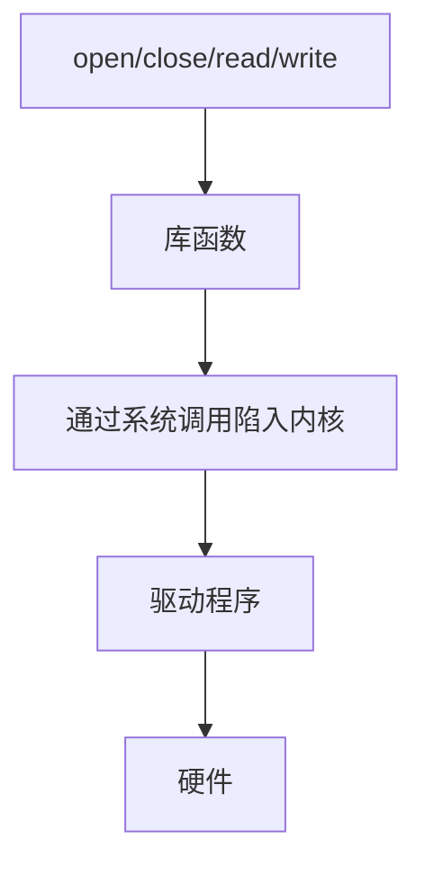

# 字符设备驱动

## 应用程序访问内核资源的三种方式
应用程序运行在用户态，内核资源/硬件资源运行在内核态，用户态无法直接访问内核态，必须通过以下三种方式完成「用户态 -> 内核态」的切换和资源访问：
- 系统调用(open/read/write/close)
- 异常 (段错误/除零错误)
- 陷入 

**应用层到硬件层的调用流程**


## 内核模块的核心框架
Linux 字符设备驱动以内核模块 (.ko) 形式存在
- 模块加载函数
```c
static int __init xxx_init(void)
{
    /* 实现设备号申请、字符设备注册、硬件初始化等核心逻辑 */
    return 0;
}
```

- 注册模块卸载函数
```c
static void __exit xxx_exit(void)
{
    /* 实现字符设备注销、硬件资源释放、设备号释放等清理逻辑 */
}

```

- 指定模块的入口/出口函数
```c
#include "linux/module.h"

module_init(xxx_init) //指定模块加载时执行的函数
module_exit(xxx_exit) //指定模块卸载时执行的函数
```

## 内核模块编译的Makefile模板
- 为什么是这样写？(reserved)
```Makefile
KERNEL_DIR := /home/tan/My_Linux/linux-imx-rel_imx_4.1.15_2.1.0_ga

CURRENT_DIR := $(shell pwd)

obj-m := chardev.o

build: kernel_modules

kernel_modules:
    $(MAKE) -C $(KERNEL_DIR) M=$(CURRENT_DIR) modules

clean:
    $(MAKE) -C $(KERNEL_DIR) M=$(CURRENT_DIR) clean
```

## 内核模块常用命令
- insmod 模块名.ko
    - 只加载指定模块，不处理依赖关系

- lsmod
    - 查看已加载的模块

- rmmod 模块名
    - 卸载指定模块

- depmod
    - 更新模块依赖

- modprobe 模块名
    - 高级加载命令，自动解决模块依赖

- modinfo
    - 查看模块的详细信息

- dmesg
    - 查看内核打印信息

## 内核打印函数printk详解
- printk
    - 内核态专属打印函数
    - 8个消息级别
```c
#define KERN_EMERG   "<0>"  // 紧急级别，系统崩溃前的最后打印，最高优先级
#define KERN_ALERT   "<1>"  // 告警级别，必须立即处理的错误
#define KERN_CRIT    "<2>"  // 严重级别，严重硬件/软件错误
#define KERN_ERR     "<3>"  // 错误级别，驱动/内核的错误（如注册失败），开发中最常用
#define KERN_WARNING "<4>"  // 警告级别，非致命错误（如参数异常），可正常运行
#define KERN_NOTICE  "<5>"  // 通知级别，重要提示信息（如模块加载成功）
#define KERN_INFO    "<6>"  // 信息级别，普通打印信息（如硬件初始化完成）
#define KERN_DEBUG   "<7>"  // 调试级别，详细调试日志，最低优先级
```

## 字符设备驱动的核心函数

### 设备注册
- 老版本驱动
    - 占用一个完整的主设备号
    - /proc/devices
```c
#include "linux/fs.h"

int register_chrdev(unsigned int major, const char *name, const struct file_operations *fops);
void unregister_chrdev(unsigned int major, const char *name);
```

### 设备号
- #define MKDEV(major, minor)  ((dev_t)(((unsigned int)(major) << 20) | (minor)))
- #define MAJOR(dev)  ((unsigned int)((dev) >> 20))

- #define MINOR(dev)  ((unsigned int)((dev) & 0xfffff))


## 内核态与用户态之间数据拷贝的核心函数
- copy_to_user / copy_from_user
    - 成功 = 0 失败 = 未拷贝成功的字节数
```c
<linux/uaccess.h>

unsigned long copy_to_user(void __user *to, const void *from, unsigned long n);
unsigned long copy_from_user(void *to, const void __user *from, unsigned long n);
```

## 物理地址映射
- ioremap / iounmap
```c
<linux/io.h>

void __iomem *ioremap(phys_addr_t phys_addr, size_t size);
void iounmap(void __iomem *addr);
```

## IO寄存器读写核心函数
- readb / readw / readl / writeb / writew / writel
```c
<linux/io.h>

u8 readb(const volatile void __iomem *addr);            // 读8位数据
u16 readw(const volatile void __iomem *addr);           // 读16位数据
u32 readl(const volatile void __iomem *addr);           // 读32位数据
void writeb(u8 value, volatile void __iomem *addr);     // 写8位数据
void writew(u16 value, volatile void __iomem *addr);    // 写16位数据
void writel(u32 value, volatile void __iomem *addr);    // 写32位数据
```
