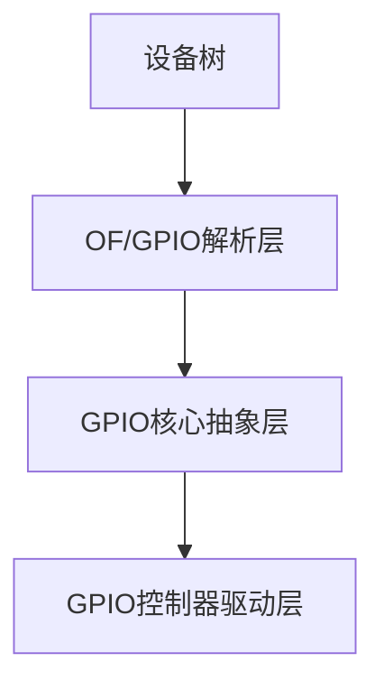

# gpio子系统
- 使用gpio子系统来使用gpio

## 一、GPIO 子系统在内核中的整体分层


## 二、设备树层
```dts
led {
    compatible = "gpio,led"
    pinctrl-names = "default";
    pinctrl-0 = <&xxx>;
    led-gpio = <&gpio1 3 GPIO_ACTIVE_LOW>; # 选择老的gpio_request，GPIO_ACTIVE_LOW将完全失效，gpio_set_value代表了物理值
};
```

## 三、OF(设备树)GPIO解析层
- \<linux/of_gpio.h\>
- GPIO数量
```c
static inline int of_gpio_named_count(struct device_node *np, const char* propname)

/* 示例 */
int num = of_gpio_named_count(np, "led-gpio");
```

- 获取GPIO编号
```c
static inline int of_get_named_gpio(
    struct device_node *np,
    const char *propname,
    int index
)
// 成功返回GPIO编号，失败返回内核的错误码

/* 示例 */
int gpio = of_get_named_gpio(np, "led-gpio", 0);
```

## 四、GPIO核心操作层
- \<linux/gpio.h\>
- GPIO申请/释放
```c
int gpio_request(unsigned gpio, const char *label)
void gpio_free(unsigned gpio)

/* 示例 */
gpio_request(gpio, "led_gpio");
gpio_free(gpio);
```

- GPIO方向设置
```c
static inline int gpio_direction_output(unsigned gpio, int value)
static inline int gpio_direction_input(unsigned gpio)

/* 示例 */
gpio_direction_input(gpio);
gpio_direction_output(gpio, value);
```

- GPIO电平操作
```c
static inline int gpio_get_value(unsigned int gpio)
static inline void gpio_set_value(unsigned int gpio, int value)

/* 示例 */
gpio_get_value(gpio);
gpio_set_value(gpio, value);
```
