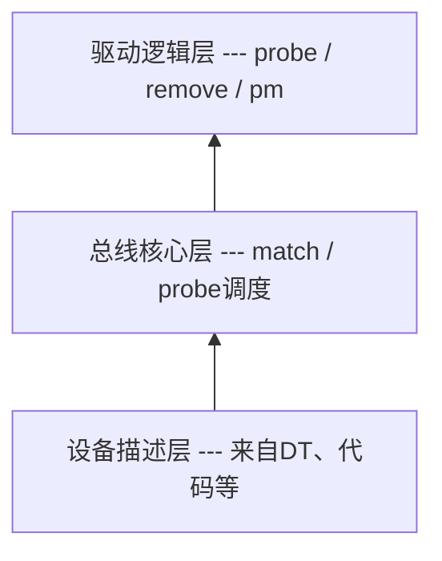

# platform总线

## 一、platform总线存在的原因

### 1.1 Linux 的驱动设计哲学
Linux内核从来不关心是谁家的驱动，它只关心：
(1)设备是什么
(2)谁来驱动它
(3)怎么撮合它们
于是衍生出了：**bus-device-driver模型**

- 驱动的分离
    - 比如将I2C控制器和I2C设备分离，主机厂编写I2C控制器驱动代码，Linux驱动框架编写具体的设备驱动
    - 通过核心层将两者关联起来

### platform总线解决了什么问题？
Soc不全是PCI / USB / I2C这种“插上就枚举”的总线，针对UART / GPIO / I2C Controller / SPI Controller / DMA/Timer / RTC这类没有总线协议枚举的，Linux引入一个概念platform：一种“虚拟总线”，专门承载SoC内部设备

## 二、总线-设备-驱动模型
- 驱动逻辑层, platform_driver
- 总线核心层，bus_type
    - 总线的工作是完成总线下的设备和驱动之间的匹配
    - /sys/bus
    - 向Linux内核注册总线：bus_register
- 设备描述层，device / platform_devices


## 三、bus_type
```c
struct bus_type {
    const char *name;
    int (*match)(struct device *dev, struct device_driver *drv);
    int (*probe)(struct device *dev);
    int (*remove)(struct device *dev);

    const struct dev_pm_ops *pm;
    ... // 不重要的内容
};
```

## 四、device_driver
```c
struct device_driver {
    const char *name;
    struct bus_type *bus;

    const struct of_device_id *of_match_table;

    int (*probe)(struct device *dev);
    int (*remove)(struct device *dev);
    ... // 不重要的内容
};
```
driver_register向总线注册驱动，会检查当前总线下的所有设备，有没有与此驱动匹配的设备，如果有就执行驱动里的probe函数

## 五、device
```c
struct device {
    struct bus_type *bus;
    struct device_driver *driver;

    struct device_node *of_node;
    void *driver_data;
};
```

- device从哪儿来
    - 有设备树 👉 由 DT 解析阶段创建
    - 无设备树 👉 由 platform_device_register() 创建

## 六、platform总线
### 6.1 platform总线是bus_type的一个实例
```c
struct bus_type platform_bus_type = {
	.name	= "platform",
	.match	= platform_match,
	.uevent	= platform_uevent,
	.pm	= &platform_dev_pm_ops,
};
```
- platform总线注册
    - platform_bus_init
    - bus_register

## 七、platform_driver和platform_device
- platform_driver
```c
struct platform_device {
	const char *name;
	int id;

	struct resource *resource;
	struct device dev;
    ... // 不重要的内容
};
```

- platform_device
```c
struct platform_driver {
	int (*probe)(struct platform_device *);
	int (*remove)(struct platform_device *);

	struct device_driver driver;
	const struct platform_device_id *id_table;
    ... // 不重要的内容
};
```

## 8、DT到platform_device的真相
- 1、内核启动早期
```text
start_kernel
 └─ setup_arch
     └─ unflatten_device_tree
```
👉 把 .dtb 解析成一棵 device_node 树

- 2、platform总线初始化
```text
platform_bus_init
 └─ bus_register(&platform_bus_type)
```

- 3、DT生成platform_device
```text
of_platform_populate()
 └─ 对每个 compatible 的 DT 节点
     └─ platform_device_alloc()
     └─ pdev->dev.of_node = node
     └─ platform_device_add()
         └─ device_register()
```
👉 此时已经有了：
- platform_device
- dev.of_node
- dev.bus = platform_bus_type

- 4、platform_driver注册
```text
platform_driver_register()
 └─ driver_register()
     └─ bus_for_each_dev()
         └─ platform_match()
             └─ of_driver_match_device()
                 └─ 匹配 compatible
                     └─ 调用 probe
```

## 九、platform_match的优先级
匹配顺序 非常重要：
1. driver_override（强制绑定）
2. of_match_table（设备树，最常用）
3. acpi_match_table
4. id_table
5. pdev->name == drv->name
