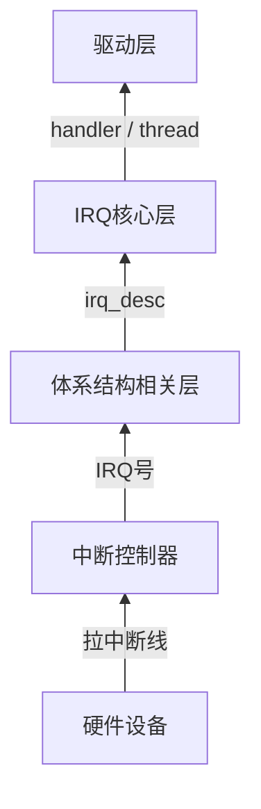

# interrupt子系统
中断的本质：CPU正在干活时，被硬件强制打断执行流，跳到一个固定入口执行代码

- 关键.c
```c
drivers/irqchip/irq-gic.c
drivers/irqchip/irqchip.c
kernel/irq/chip.c
kernel/irq/handle.c
kernel/irq/irqdesc.c
kernel/irq/irqdomain.c
kernel/irq/manage.c
```

## 一、interrupt子系统的整体架构


## 二、中断从哪里进入C代码
- CPU响应IRQ之后，跳到异常向量，最终进入汇编
```text
 └─ __irq_svc
     └─ irq_handler
         └─ handle_arch_irq
```

- handle_arch_irq跳到真正的C入口asm_do_IRQ，将IRQ交给irq_domain体系
```
 └─ asm_do_IRQ
     └─ handle_IRQ
         └─ __handle_domain_irq
```

## irq_domain
- irq_domain的作用，将硬件中断号(hwirq)翻译成Linux irq号

- GIC / GPIO都会创建irq_domain
    - drivers/irqchip/irq-gic.c
    - drivers/gpio/gpio-imx.c

```c
irq_domain_add_*()

gpio_to_irq，本质就是GPIO hwirq → GPIO irq_domain → Linux irq
```

## irq_desc
每一个Linux irq都对应一个struct irq_desc，里面包含：
- irq_chip（硬件操作）
- handle_irq（边沿 / 电平处理函数）
- irqaction（注册的handler链表）

## 驱动层
```c
#include <linux/gpio.h>

/* 获取中断号 */
unsigned int irq_of_parse_and_map(struct device_node *dev, int index)
int gpio_to_irq(unsigned int gpio); // 成功返回IRQ号，失败返回负数错误码

#include <linux/irqreturn.h>

enum irqreturn {
    IRQ_NONE            = (0 << 0),
    IRQ_HANDLED         = (1 << 0),
    IRQ_WAKE_THREAD     = (1 << 1),
};

typedef enum irqreturn irqreturn_t;

typedef irqreturn_t (*irq_handler_t)(int, void *);
irqreturn_t my_irq_handler(int irq, void *dev_id)
{
    return IRQ_HANDLED;
}

#include <linux/interrupt.h>

/* flags */
#define IRQF_TRIGGER_NONE       0x00000000
#define IRQF_TRIGGER_RISING     0x00000001
#define IRQF_TRIGGER_FALLING    0x00000002
#define IRQF_TRIGGER_HIGH       0x00000004
#define IRQF_TRIGGER_LOW        0x00000008
#define IRQF_TRIGGER_MASK       (IRQF_TRIGGER_HIGH | IRQF_TRIGGER_LOW | \
                                IRQF_TRIGGER_RISING | IRQF_TRIGGER_FALLING)
#define IRQF_TRIGGER_PROBE      0x00000010

#define IRQF_SHARED         0x00000080
#define IRQF_PROBE_SHARED   0x00000100
#define __IRQF_TIMER        0x00000200
#define IRQF_PERCPU         0x00000400
#define IRQF_NOBALANCING    0x00000800
#define IRQF_IRQPOLL        0x00001000
#define IRQF_ONESHOT        0x00002000
#define IRQF_NO_SUSPEND     0x00004000
#define IRQF_FORCE_RESUME   0x00008000
#define IRQF_NO_THREAD      0x00010000
#define IRQF_EARLY_RESUME   0x00020000
#define IRQF_COND_SUSPEND   0x00040000

#define IRQF_TIMER		(__IRQF_TIMER | IRQF_NO_SUSPEND | IRQF_NO_THREAD)

/* 申请中断 */
static inline int __must_check request_irq(
    unsigned int irq,
    irq_handler_t handler,
    unsigned long flags,
    const char *name,
    void *dev
) // 注册成功返回0，注册失败返回负数的errno

在/proc/interrupts可以看到名为name的中断

void free_irq(unsigned int irq, void *dev_id);

/* 使能中断 */
void enable_irq(unsigned int irq)

/* 禁止中断，等当前正在执行的中断处理函数执行完才返回 */
void disable_irq(unsigned int irq)
/* 禁止中断 */
void disable_irq_nosync(unsigned int irq)

/* 打开/关闭处理器中断 */
local_irq_enable()
local_irq_disable()

local_irq_save(flags)
local_irq_restore(flags)
```

## 中断的下半部分
- 软中断，不要使用

- tasklet
```c
#include <linux/interrupt.h>

struct tasklet_struct
{
	struct tasklet_struct *next;
	unsigned long state;
	atomic_t count;
	void (*func)(unsigned long);
	unsigned long data;
};

/* 也需要用到上半部分来调用tasklet_schedule */
static inline void tasklet_schedule(struct tasklet_struct *t)

/* 初始化 */
void tasklet_init(struct tasklet_struct *t,
		  void (*func)(unsigned long), unsigned long data)
```

- 工作队列
```c
#include <linux/workqueue.h>

struct work_struct {
	atomic_long_t data;
	struct list_head entry;
	work_func_t func;
};

struct workqueue_struct {
	struct list_head	pwqs;
	struct list_head	list;
	struct mutex		mutex;
	int			work_color;
	int			flush_color;
	atomic_t		nr_pwqs_to_flush;
	struct wq_flusher	*first_flusher;
	struct list_head	flusher_queue;
	struct list_head	flusher_overflow;
	struct list_head	maydays;
	struct worker		*rescuer;
	int			nr_drainers;
	int			saved_max_active;
	struct workqueue_attrs	*unbound_attrs;
	struct pool_workqueue	*dfl_pwq;
	char			name[WQ_NAME_LEN];
	struct rcu_head		rcu;
	unsigned int		flags ____cacheline_aligned;
	struct pool_workqueue __percpu *cpu_pwqs;
	struct pool_workqueue __rcu *numa_pwq_tbl[];
};

/* 初始化工作 */
#define INIT_WORK(_work, _func)

/* 调度工作 */
static inline bool schedule_work(struct work_struct *work)
```

## 按键中断实例
- 设备树
```dts
intc: interrupt-controller@00a01000 {
    compatible = "arm,cortex-a7-gic";
    #interrupt-cells = <3>;
    interrupt-controller;
    reg = <0x00a01000 0x1000>,
          <0x00a02000 0x100>;
};

#interrupt-cells指定了interrupts的cell的数量
interrupt-controller指定了该节点是中断控制器

gpio5: gpio@020ac000 {
    compatible = "fsl,imx6ul-gpio", "fsl,imx35-gpio";
    reg = <0x020ac000 0x4000>;
    interrupts = <GIC_SPI 74 IRQ_TYPE_LEVEL_HIGH>,  // <type irq flags>
                 <GIC_SPI 75 IRQ_TYPE_LEVEL_HIGH>;
    gpio-controller;
    #gpio-cells = <2>;
    interrupt-controller;
    #interrupt-cells = <2>;
};

// 实际驱动编写的内容
key0: key@0 {
    compatible = "mygpio-key";
    gpios = <&gpio1 5 GPIO_ACTIVE_LOW>;
    interrupt-parent = <&gpio1>;
    interrupts = <5 IRQ_TYPE_EDGE_FALLING>; // <pin flags>
};
```

- 中断上半部
```c
static irqreturn_t key_irq_handler(int irq, void *dev_id)
{
    pr_info("key pressed! irq=%d\n", irq);

    /* 这里不能睡眠，不能拿 mutex */

    return IRQ_HANDLED;
}
```

- probe申请中断
```c
static int key_probe(struct platform_device *pdev)
{
    int ret;
    int gpio;
    int irq;

    gpio = of_get_named_gpio(pdev->dev.of_node, "gpios", 0);
    gpio_request(gpio, "key_gpio");
    gpio_direction_input(gpio);
    irq = gpio_to_irq(gpio);
    ret = request_irq(irq,
                    key_irq_handler,
                    IRQF_TRIGGER_FALLING,
                    "key_irq",
                    &pdev->dev);
    if (ret)
        return ret;

    return 0;
}
```

- remove中释放中断
```c
static int key_remove(struct platform_device *pdev)
{
    int irq = gpio_to_irq(gpio);

    free_irq(irq, &pdev->dev);
    gpio_free(gpio);

    return 0;
}
```
