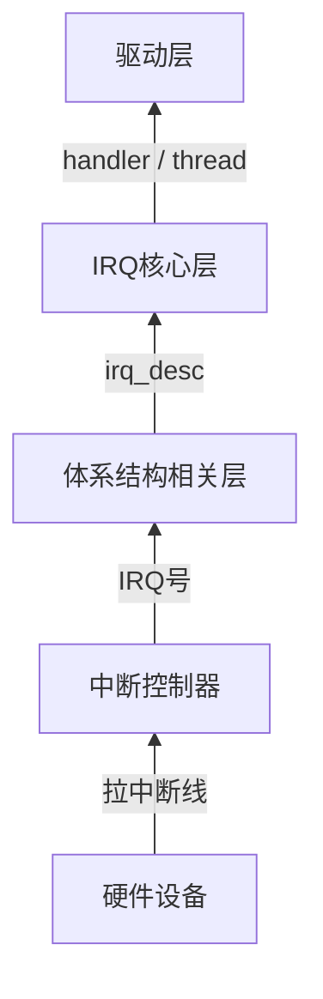

# interrupt子系统
中断的本质：CPU正在干活时，被硬件强制打断执行流，跳到一个固定入口执行代码

- 关键.c
```c
drivers/irqchip/irq-gic.c
drivers/irqchip/irqchip.c
kernel/irq/chip.c
kernel/irq/handle.c
kernel/irq/irqdesc.c
kernel/irq/irqdomain.c
kernel/irq/manage.c
```

## 一、interrupt子系统的整体架构


## 二、中断从哪里进入C代码
- CPU响应IRQ之后，跳到异常向量，最终进入汇编
```text
 └─ __irq_svc
     └─ irq_handler
         └─ handle_arch_irq
```

- handle_arch_irq跳到真正的C入口asm_do_IRQ，将IRQ交给irq_domain体系
```
 └─ asm_do_IRQ
     └─ handle_IRQ
         └─ __handle_domain_irq
```

## irq_domain
- irq_domain的作用，将硬件中断号(hwirq)翻译成Linux irq号

- GIC / GPIO都会创建irq_domain
    - drivers/irqchip/irq-gic.c
    - drivers/gpio/gpio-imx.c

```c
irq_domain_add_*()

gpio_to_irq，本质就是GPIO hwirq → GPIO irq_domain → Linux irq
```

## irq_desc
每一个Linux irq都对应一个struct irq_desc，里面包含：
- irq_chip（硬件操作）
- handle_irq（边沿 / 电平处理函数）
- irqaction（注册的handler链表）

## GPIO中断实例
- 设备树
```dts
key0: key@0 {
    compatible = "mygpio-key";
    gpios = <&gpio1 5 GPIO_ACTIVE_LOW>;
    interrupt-parent = <&gpio1>;
    interrupts = <5 IRQ_TYPE_EDGE_FALLING>;
};
```

- 中断上半部
```c
static irqreturn_t key_irq_handler(int irq, void *dev_id)
{
    pr_info("key pressed! irq=%d\n", irq);

    /* 这里不能睡眠，不能拿 mutex */

    return IRQ_HANDLED;
}
```

- probe申请中断
```c
static int key_probe(struct platform_device *pdev)
{
    int ret;
    int gpio;
    int irq;

    gpio = of_get_named_gpio(pdev->dev.of_node, "gpios", 0);
    gpio_request(gpio, "key_gpio");
    gpio_direction_input(gpio);
    irq = gpio_to_irq(gpio);
    ret = request_irq(irq,
                    key_irq_handler,
                    IRQF_TRIGGER_FALLING,
                    "key_irq",
                    &pdev->dev);
    if (ret)
        return ret;

    return 0;
}
```

- remove中释放中断
```c
static int key_remove(struct platform_device *pdev)
{
    int irq = gpio_to_irq(gpio);

    free_irq(irq, &pdev->dev);
    gpio_free(gpio);

    return 0;
}
```
