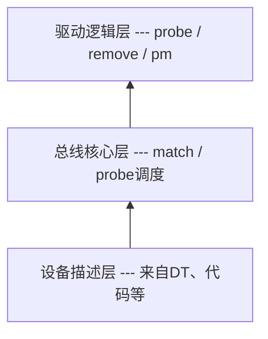

# platform总线

## 一、platform总线存在的原因

### 1.1 Linux 的驱动设计哲学
Linux内核它只关心：(1)设备是什么 (2)谁来驱动它 (3)怎么撮合它们，不关心是谁家的芯片，于是衍生出了**bus-device-driver模型**

### 1.2 platform总线解决了什么问题？
- Soc不全是PCI / USB / I2C这种“插上就枚举”的总线 ，还有UART / GPIO / I2C Controller / SPI Controller / DMA / Timer / RTC这类没有总线协议枚举的
- Linux引入一个概念platform：一种“虚拟总线”，专门承载SoC内部设备

## 二、总线-设备-驱动模型
- 驱动逻辑层, device_driver
- 总线核心层，bus_type
    - 总线的工作是完成总线下的设备和驱动之间的匹配
    - /sys/bus
    - 向Linux内核注册总线：bus_register
- 设备描述层，device


## 三、bus_type
```c
#include <linux/device.h>

struct bus_type {
    const char *name;
    int (*match)(struct device *dev, struct device_driver *drv);
    int (*probe)(struct device *dev);
    int (*remove)(struct device *dev);

    const struct dev_pm_ops *pm;
    ... // 不重要的内容
};
```

## 四、device_driver
```c
#include <linux/device.h>

struct device_driver {
    const char *name;
    struct bus_type *bus;

    const struct of_device_id *of_match_table;

    int (*probe)(struct device *dev);
    int (*remove)(struct device *dev);
    ... // 不重要的内容
};
```
driver_register向总线注册驱动，会检查当前总线下的所有设备，有没有与此驱动匹配的设备，如果有就执行驱动里的probe函数

## 五、device
```c
#include <linux/device.h>

struct device {
    struct bus_type *bus;
    struct device_driver *driver;

    struct device_node *of_node;
    void *driver_data;
};
```

## 六、platform总线
- platform总线是bus_type的一个实例
```c
struct bus_type platform_bus_type = {
	.name	= "platform",
	.match	= platform_match,
	.uevent	= platform_uevent,
	.pm	= &platform_dev_pm_ops,
};
```

## 七、platform_device
- platform_device = device + SoC资源信息
```c
#include <linux/platform_device.h>

struct platform_device {
    const char *name;
    int id;

    struct resource *resource;
    struct device dev;
    ... // 不重要的内容
};
```

- platform_device的来源
    - 设备树，详情见第9章DT到platform_device的真相
    - 老派写法，如下所示
```c
#include <linux/platform_device.h>

static struct resource uart_res[] = {
    {
        .start = 0x10000000,
        .end   = 0x10000fff,
        .flags = IORESOURCE_MEM,
    },
    {
        .start = 32,
        .end   = 32,
        .flags = IORESOURCE_IRQ,
    },
};

static struct platform_device uart_pdev = {
    .name = "my_uart",
    .id   = -1,
    .num_resources = ARRAY_SIZE(uart_res),
    .resource = uart_res,
};

platform_device_register(&uart_pdev);
```

## 八、platform_driver
- platform_driver，并没有多加功能，只是把device_driver包在结构体
```c
#include <linux/platform_device.h>

struct platform_device_id {
    char name[PLATFORM_NAME_SIZE];
    kernel_ulong_t driver_data;
};

struct platform_driver {
    int (*probe)(struct platform_device *);
    int (*remove)(struct platform_device *);

    struct device_driver driver;
    const struct platform_device_id *id_table;
    ... // 不重要的内容
};
```

- platform_driver的注册函数
```c
int platform_driver_register(struct platform_driver *drv);
```

## 九、DT到platform_device的真相
- 1、内核启动早期
```text
start_kernel
 └─ setup_arch
     └─ unflatten_device_tree
```
👉 把 .dtb 解析成一棵 device_node 树

- 2、platform总线初始化
```text
platform_bus_init
 └─ bus_register(&platform_bus_type)
```

- 3、DT生成platform_device
```text
of_platform_populate()
 └─ 对每个 compatible 的 DT 节点
     └─ platform_device_alloc()
     └─ pdev->dev.of_node = node
     └─ platform_device_add()
         └─ device_register()
```
👉 此时已经有了：
- platform_device
- dev.of_node
- dev.bus = platform_bus_type

- 4、platform_driver注册
```text
platform_driver_register()
 └─ driver_register()
     └─ bus_for_each_dev()
         └─ platform_match()
             └─ of_driver_match_device()
                 └─ 匹配 compatible
                     └─ 调用 probe
```

## 九、platform_match的优先级
匹配顺序 非常重要：
1. driver_override（强制绑定）
2. of_match_table（设备树，最常用）
3. acpi_match_table
4. id_table
5. pdev->name == drv->name
