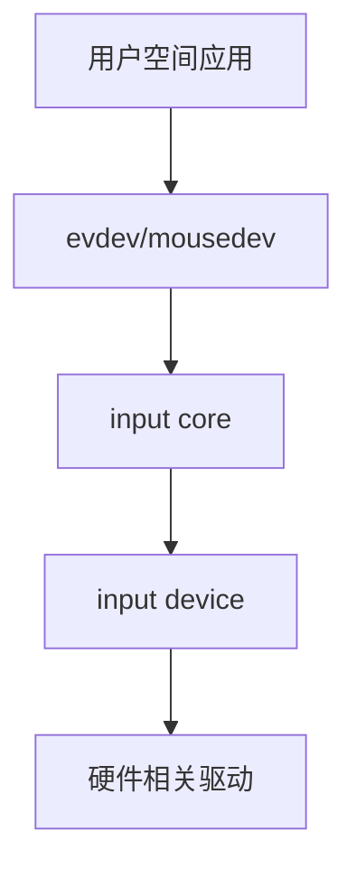

# input子系统
- 按键、鼠标、键盘、触摸屏等都属于输入设备，Linux内核为此专门做了一个叫做input子系统的框架来处理输入事件
- 本质上还是字符设备(drivers/input/input.c)，只是在此基础上套上了input框架

## 一、input子系统的整体架构
### 1.1 框架图


### 1.2 驱动层
- 初始化硬件
- 在中断 / 轮询中读取数据
- 将“原始状态”翻译为输入事件

### 1.3 input_device层
```c
struct input_dev {
    /* 设备标识 */
    const char *name;
    const char *phys;
    struct input_id id;

    /* 能力描述（核心） */
    unsigned long evbit[BITS_TO_LONGS(EV_CNT)];     // 设备支持的事件类型
    unsigned long keybit[BITS_TO_LONGS(KEY_CNT)];   // 在EV_KET类型里面，我支持哪些按键，不能我不支持，你乱上报
    unsigned long absbit[BITS_TO_LONGS(ABS_CNT)];
    unsigned long relbit[BITS_TO_LONGS(REL_CNT)];
    unsigned long swbit[BITS_TO_LONGS(SW_CNT)];

    /* 绝对轴参数（用 ABS_* 才需要） */
    struct input_absinfo absinfo[ABS_CNT];

    /* 生命周期回调（强烈建议） */
    int  (*open)(struct input_dev *dev);
    void (*close)(struct input_dev *dev);

    /* 设备模型 */
    struct device dev;
};
```
- input_dev
    - evbit，我能产生哪些事件大类
        - EV_SYN
        - EV_KEY
        - EV_REL
        - EV_ABS
    - keybit / absbit / relbit，在这个大类下，我支持哪些事件

    - name / phys / id，纯粹是给人和用户空间识别用的

### 1.4 input_core层
input子系统真正的“系统级的存在”，它主要干以下四件事：
- 管理所有input_dev
- 管理所有input_handler
- 完成设备与handler的自动匹配
- 分发事件

如何理解input_core机制：发布-订阅系统
- input_dev是事件发布者
- evdev / mousedev是事件订阅者
- input_core负责
    - 谁订阅了谁
    - 事件发给谁

### 1.5 input_handler层
典型的handler如下：
```text
evdev → /dev/input/eventX
mousedev → /dev/input/mic
```

handler的行为：
- 为每个input_dev创建一个eventX
- 把input_event放进一个环形缓冲队列
- 支持poll / read / select

### 1.6 用户空间
用户空间只看到标准事件流
```c
struct timeval {
    __kernel_time_t         tv_sec;		/* seconds */
    __kernel_suseconds_t    tv_usec;	/* microseconds */
};  // __kernel_time_t和__kernel_suseconds_t都是long

struct input_event {
    struct timeval time;
    __u16 type;
    __u16 code;
    __s32 value;
};
```

## 二、input子系统的整体工作流程
```
[系统启动]
    |
    |-- input_init()        -> 注册 input core
    |-- evdev_init()        -> 注册 evdev handler
    |
[平台驱动 probe]
    |
    |-- input_allocate_device()
    |-- input_register_device()
            |
            |-- input core 扫描所有 handler
                    |
                    |-- evdev_connect()
                            |
                            |-- 注册字符设备
                            |-- /dev/input/eventX 出现
    |
[硬件中断]
    |
    |-- input_report_key()
            |
            |-- input core 分发
                    |
                    |-- evdev_event()
                            |
                            |-- 放入队列
                            |-- 唤醒用户进程

```

## 三、驱动层
典型input驱动在probe里做的事非常固定
- input_allocate_device
- 填能力位（evbit / keybit / absbit）
    - input_set_capability
- input_register_device
- 硬件事件发生时：
    - input_report_xxx
    - input_sync

```c
/* 分配input_dev */
struct input_dev *input_allocate_device(void)
void input_free_device(struct input_dev *dev)

/* 注册input_dev到input_core */
int input_register_device(struct input_dev *dev)
void input_unregister_device(struct input_dev *dev)

/* 设置能力位的方式 */
void input_set_capability(struct input_dev *dev,
                          unsigned int type,
                          unsigned int code)
set_bit(unsigned int nr, volatile unsigned long *addr)

/* 事件上报，input_report_xxx最常见 */
void input_report_key(struct input_dev *dev,
                      unsigned int code,
                      int value)
void input_report_rel(struct input_dev *dev,
                      unsigned int code,
                      int value)
void input_report_abs(struct input_dev *dev,
                      unsigned int code,
                      int value)
void input_event(struct input_dev *dev,
                 unsigned int type,
                 unsigned int code,
                 int value)

/* 标记事件结束 */
void input_sync(struct input_dev *dev)
```
