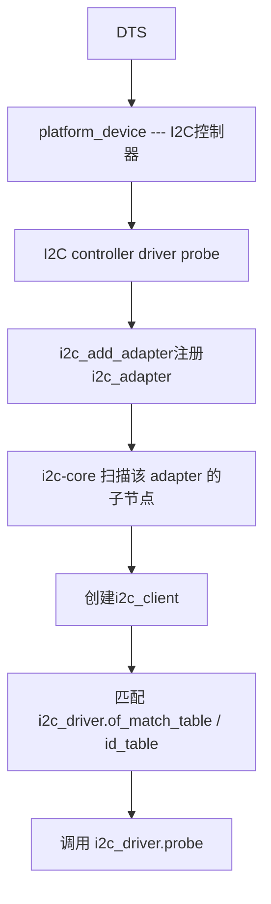

# I2C驱动

## 一、I2C子系统概述
### 1.1 I2C驱动的目的
- 提供统一的I2C框架(不同SoC复用同一套API)
- 将“I2C控制器硬件细节”与“I2C从设备协议”解耦
- 核心思想：
    - adapter(控制器驱动)负责生成波形
    - client(设备实例)描述从机
    - driver(设备驱动)实现芯片逻辑
    - i2c-core负责粘合

### 1.2 I2C三件套职责划分
|对象|层级|由谁提供|作用|
|---|---|---|---|
|i2c_adapte|控制器层(SoC)|SoC厂商 / 平台驱动(如NXP)|代表一条 I2C 总线控制器|
|i2c_client|设备层(从机实例)|设备树解析自动创建|代表某条I2C总线上的一个从设备|
|i2c_driver|设备层(从机驱动)|驱动开发者|匹配client并执行probe / remove|

## 二、运行时模型(设备如何出现)
### 2.1 设备树到驱动的链路


### 2.2 I2C设备树结构示例
#### 2.2.1 I2C控制器节点
```dts
i2c1: i2c@021a0000 {
    #address-cells = <1>;
    #size-cells = <0>;
    compatible = "fsl,imx6ul-i2c", "fsl,imx21-i2c";
    reg = <0x021a0000 0x4000>;
    interrupts = <GIC_SPI 36 IRQ_TYPE_LEVEL_HIGH>;
    clocks = <&clks IMX6UL_CLK_I2C1>;
    status = "disabled";
};
```

#### 2.2.2 I2C从设备节点(挂在控制器下)
```dts
&i2c1 {
    clock-frequency = <100000>;
    pinctrl-names = "default";
    pinctrl-0 = <&pinctrl_i2c1>;
    status = "okay";

    aht20@38 {
        compatible = "myboard,aht20";
        reg = <0x38>;
    };
};
```
- compatible用于匹配i2c_driver
- reg就是I2C从机地址

## 三、I2C核心数据结构
### 3.1 struct i2c_adapter(控制器抽象)
- 代表一条I2C bus
- 由控制器驱动注册到i2c-core
- 核心字段：
```c
struct i2c_adapter {
    struct device dev;
    const struct i2c_algorithm *algo;  // 关键：传输实现
    int nr;                            // bus number
    char name[48];
};
```

### 3.2 struct i2c_algorithm(控制器传输算法)
- 真正实现I2C的读写波形(START / STOP / ACK)
- i2c-core通过它调用到底层控制器驱动
- 核心字段：
```c
struct i2c_algorithm {
    int (*master_xfer)(struct i2c_adapter *adap,
                       struct i2c_msg *msgs,
                       int num);
    u32 (*functionality)(struct i2c_adapter *adap);
};
```

### 3.3 struct i2c_client(从设备对象)
- 表示挂在某条i2c_adapter上的一个从机
- 关键字段：
```c
struct i2c_client {
    unsigned short addr;        // 从机地址
    struct i2c_adapter *adapter;// 属于哪条 I2C 总线
    struct device dev;
};
```

### 3.4 struct i2c_driver(从设备驱动)
- 用于匹配i2c_client并执行probe / remove
- 关键字段：
```c
struct i2c_driver {
    int (*probe)(struct i2c_client *client);
    void (*remove)(struct i2c_client *client);
    const struct i2c_device_id *id_table;
    struct device_driver driver;                // 包含 of_match_table
};
```

## 四、驱动注册API(i2c_driver)
### 4.1 注册 / 注销API
```c
int i2c_register_driver(struct module *owner, struct i2c_driver *driver);

#define i2c_add_driver(driver) \
    i2c_register_driver(THIS_MODULE, driver)

void i2c_del_driver(struct i2c_driver *driver);
```

### 4.2 设备树匹配写法(最常用)
```c
static const struct of_device_id ap3216c_of_match[] = {
    {.compatible = "myboard,ap3216c"},
    {}
};

static const struct i2c_device_id ap3216c_id_table[] = {
    {"ap3216c", 0},
    {}
};

static struct i2c_driver ap3216c_driver = {
    .probe  = ap3216c_probe,
    .remove = ap3216c_remove,
    .driver = {
        .name = "ap3216c",
        .of_match_table = ap3216c_of_match,
    },
};

module_i2c_driver(ap3216c_driver);
```

## 五、I2C传输API(i2c_transfer)
### 5.1 struct i2c_msg(核心)
```c
#define I2C_M_RD    0x0001  /* read data, from slave to master */
#define I2C_M_TEN   0x0010  /* 10-bit address */

struct i2c_msg {
    __u16 addr;    /* slave address */
    __u16 flags;
    __u16 len;     /* msg length */
    __u8  *buf;    /* pointer to msg data */
};
```
- addr字段不属于buf

### 5.2 i2c_transfer原型
```c
int i2c_transfer(struct i2c_adapter *adap,
                 struct i2c_msg *msgs,
                 int num) // 成功：返回传输成功的msg数量 失败：返回负数的errno
```
- adap：目标I2C bus(client->adapter)
- msgs：消息数组
- num：消息个数(一次事务transaction)
