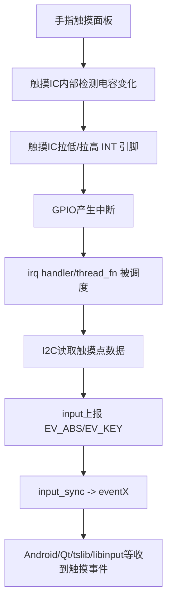

# 电容触摸屏
## 一、电容触摸屏整体架构
### 1.1 本质是什么？
- 触摸IC一般挂在I2C总线上
- 驱动核心：
    - I2C：读触摸寄存器 / 坐标数据
    - GPIO INT：触摸事件触发中断
    - input：把触摸点上报给Linux输入系统(最终到/dev/input/eventX)

### 1.2 数据链路


## 二、设备树典型写法
- 触摸IC设备树节点示例
```dts
&i2c1 {
    status = "okay";

    touchscreen@38 {
        compatible = "goodix,gt911";   // 举例，不同IC不同compatible
        reg = <0x38>;
        interrupt-parent = <&gpio1>;
        interrupts = <9 IRQ_TYPE_EDGE_FALLING>; // 常见：下降沿触发
        reset-gpios = <&gpio1 10 GPIO_ACTIVE_LOW>;
    };
};
```

### 三、驱动运行模型
- probe的典型任务清单
    - 解析设备树
        - I2C地址(client->addr)
        - reset-gpios / irq-gpios

    - 硬件初始化
        - 复位触摸IC
        - 读芯片ID

    - 注册input_dev
        - input_allocate_device
        - input_set_abs_params
        - 多点协议初始化

    - 申请中断
        - devm_request_threaded_irq

## 多点触摸协议(Type A / Type B)
### 4.1 Type A
- Type A，适用于触摸点不能被区分 / 追踪，此类型的设备上报原始数据
- 上报格式
```text
ABS_MT_POSITION_X   x[0]    // 第一个点x轴坐标
ABS_MT_POSITION_Y   y[0]    // 第一个点y轴坐标
SYN_MT_REPORT               // 点与点之间用这个隔离
ABS_MT_POSITION_X   x[1]
ABS_MT_POSITION_Y   y[1]
SYN_MT_REPORT
SYN_REPORT
```

```c
// ABS_MT_POSITION_X
static inline void input_report_abs(struct input_dev *dev, unsigned int code, int value)
{
    input_event(dev, EV_ABS, code, value);
}

// SYN_MT_REPORT
static inline void input_mt_sync(struct input_dev *dev)
{
    input_event(dev, EV_SYN, SYN_MT_REPORT, 0);
}

// SYN_REPORT
static inline void input_sync(struct input_dev *dev)
{
    input_event(dev, EV_SYN, SYN_REPORT, 0);
}
```

### 4.2 Type B
- Type B，适用于有硬件追踪并能区分触摸点的触摸设备
- 上报格式
```text
ABS_MT_SLOT 0
ABS_MT_TRACKING_ID 45  
ABS_MT_POSITION_X   x[0]    // 第一个点x轴坐标
ABS_MT_POSITION_Y   y[0]    // 第一个点y轴坐标
ABS_MT_SLOT 1
ABS_MT_TRACKING_ID 46  
ABS_MT_POSITION_X   x[1]    // 第一个点x轴坐标
ABS_MT_POSITION_Y   y[1]    // 第一个点y轴坐标
SYN_REPORT
```

## 五、input多点触摸关键API
- 初始化slots
```c
int input_mt_init_slots(
    struct input_dev *dev,
    unsigned int num_slots,
    unsigned int flags
)

常用flags
    - INPUT_MT_DIRECT
    - INPUT_MT_POINTER
```

- 设置坐标轴范围
```c
void input_set_abs_params(
    struct input_dev *dev,
    unsigned int axis,
    int min,
    int max,
    int fuzz,
    int flat
)
```

- Type B上报核心三件套
```c
/* 切换 */
static inline void input_mt_slot(struct input_dev *dev, int slot)
{
    input_event(dev, EV_ABS, ABS_MT_SLOT, slot);
}

/* 设置tracking id / 抬起手指 */
void input_mt_report_slot_state(
    struct input_dev *dev,
    unsigned int tool_type,
    bool active
)

tool_type，一般用MT_TOOL_FINGER
active=true：内核会自动填ABS_MT_TRACKING_ID
active=false：内核会把tracking id置为-1表示抬起

/* 上报坐标 + 同步 */
static inline void input_report_abs(struct input_dev *dev, unsigned int code, int value)
{
    input_event(dev, EV_ABS, code, value);
}

static inline void input_sync(struct input_dev *dev)
{
    input_event(dev, EV_SYN, SYN_REPORT, 0);
}
```

```c
// 申请GPIO

```

